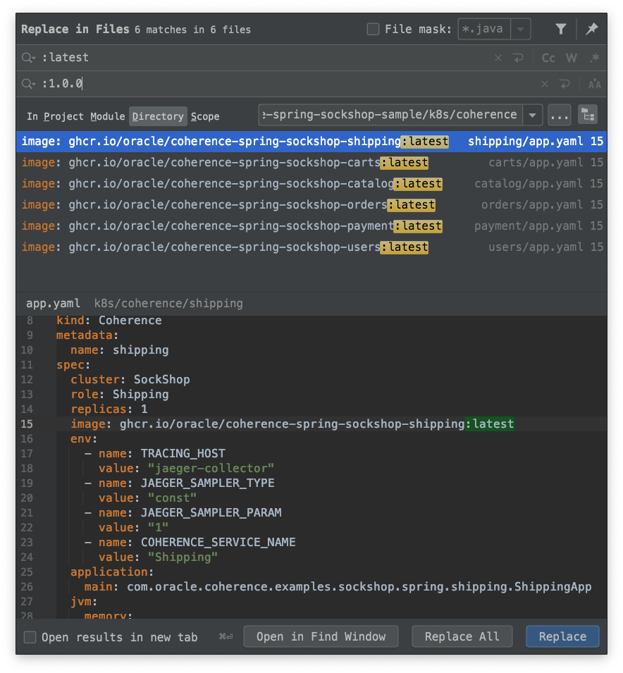
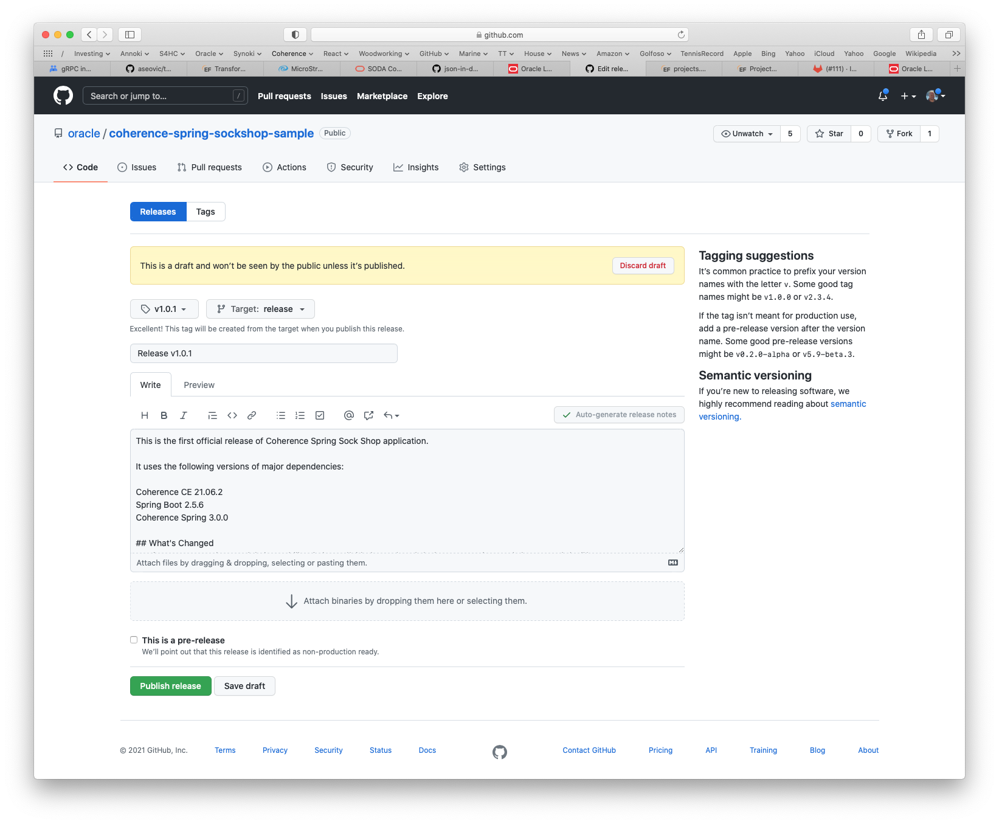
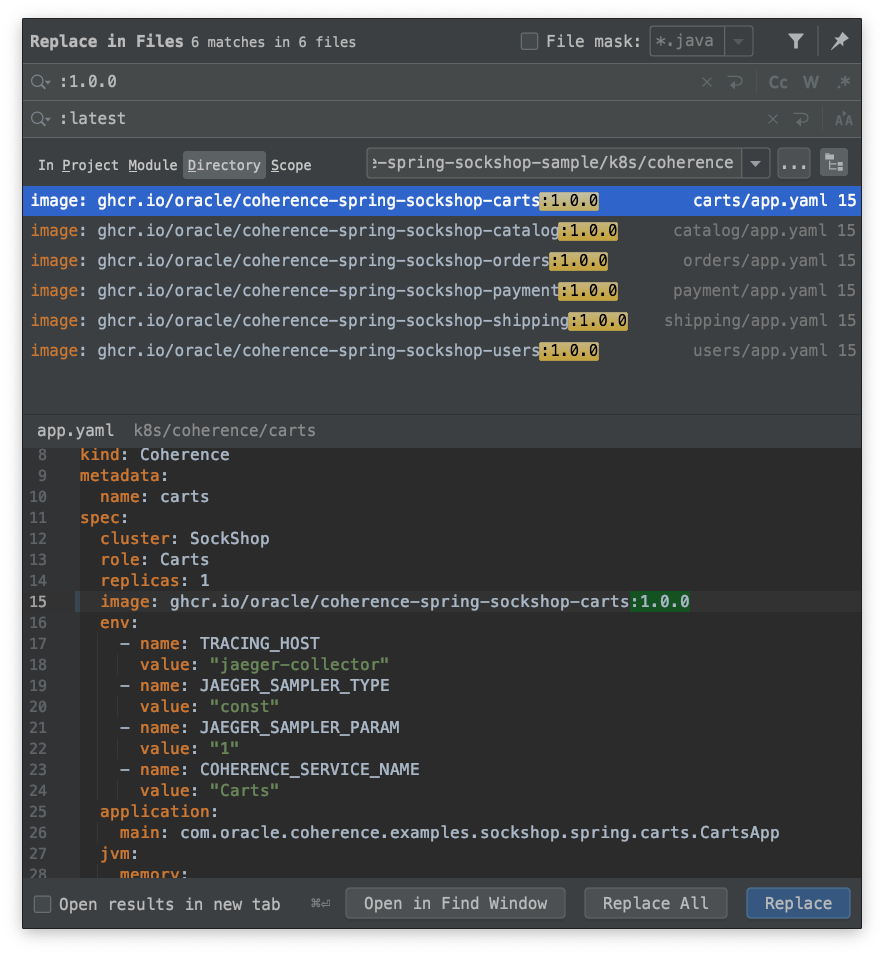

## Release Process

This page documents the process to release this demo app. For the most part, the release process is automated via GitHub Actions workflow defined in [release.yaml](../.github/workflows/release.yaml), but there are some manual steps that need to be done before the workflow can do the build and publish Docker images to ghcr.io.

### Step-by-step guide

Please do the following in order to release this Sock Shop implementation:

#### 1. Set the version in all the POMs to the desired release version (in this example I'll use 1.0.0)
```bash
mvn versions:set -DnewVersion=1.0.0 -DprocessAllModules=true -DoldVersion='*'
```

#### 2. Replace `:latest` with `:<version>` in all YAML files under `k8s/coherence`


#### 3. Commit the changes to `master` branch and push them
```bash
git commit -a -m "Set version to 1.0.0 for the release"
git push
```
    
#### 4. Bring `release` branch in sync with the `master` branch

```bash
git push origin master:release
```

#### 5. Create and publish release on GitHub


> **Note:** Make you sure that you create tag using `vX.Y.Z` format for the version number, and
> that you select `release` branch as a target!

This should kick off release process which you can monitor on Actions tab. Once the build completes successfully and the images are published to ghcr.io, proceed with the following steps.

If anything went wrong, see the "If Something Goes Wrong" section below.
      
#### 6. Set the version in all the POMs to next development version 

```bash
mvn versions:set -DnewVersion=1.0.1-SNAPSHOT -DprocessAllModules=true -DoldVersion='*'
```

#### 7. Replace `:<version>` with `:latest` in all YAML files under `k8s/coherence`


#### 8. Commit the changes to `master` branch and push them
```bash
git commit -a -m "Set version to 1.0.1-SNAPSHOT"
git push
```

### If Something Goes Wrong

In case anything goes wrong and the results are not as expected, you need to undo the changes, fix the cause of the problem and retry.

To undo the release:

#### 1. Delete the release on GitHub by clicking on the trash can icon on the release page

#### 2. Delete the tag from the repo

```bash
git push --delete origin v1.0.0
```

Fix the problem, then you can "rinse and repeat" from the beginning.